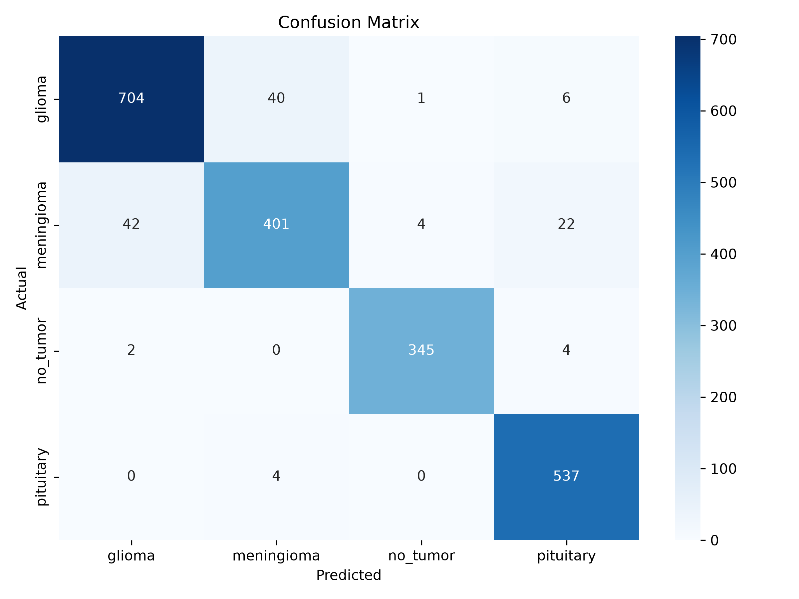
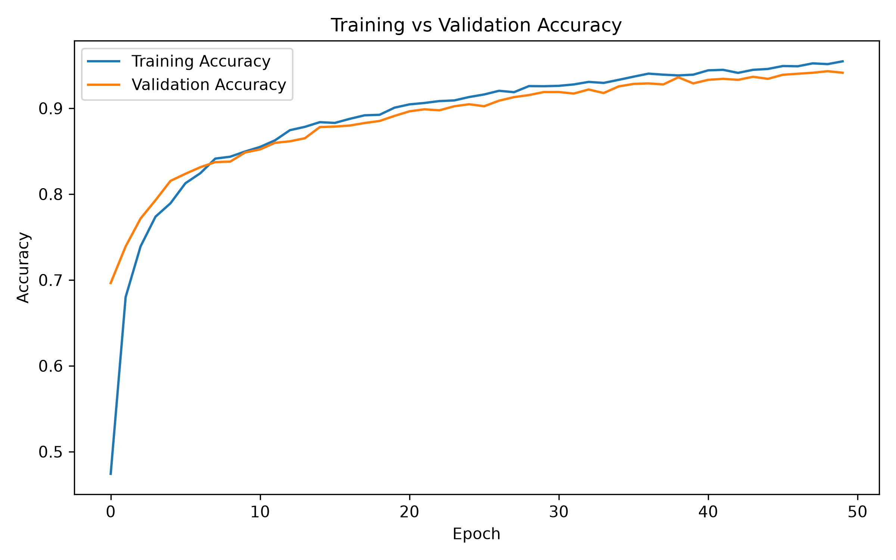
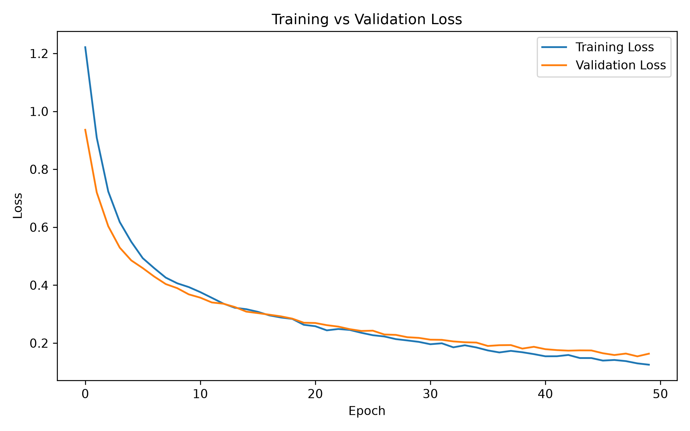

Yes. Copy-paste this **entire README** and replace your current one:

````markdown
# 🧠 Brain Tumor Detection

A deep learning-based brain tumor classification system that analyzes MRI images and classifies them into four categories:

- **Glioma**
- **Meningioma**
- **No Tumor**
- **Pituitary**

The project includes exploratory data analysis, image preprocessing, model training, evaluation, confusion matrix analysis, and image-level prediction.

---

## 🚀 Features

- MRI brain image classification
- Four-class tumor classification
- Exploratory Data Analysis (EDA)
- Image preprocessing
- Deep learning model training
- Model evaluation
- Confusion matrix generation
- Classification report
- Individual image prediction
- Prediction confidence scores
- Error analysis of misclassified images

---

## 🧠 Model

The project uses **EfficientNetB0** as the deep learning backbone for MRI image classification.

Input images are resized to:

```text
224 × 224 × 3
````

The model outputs probabilities for four classes:

```text
Glioma
Meningioma
No Tumor
Pituitary
```

---

## 📊 Dataset

The project was evaluated using **two different datasets/experiments**.

### Experiment 1 — Large Dataset

* Test images: **2,112**
* Accuracy: **94.08%**
* Precision: **94.03%**
* Recall: **94.08%**
* F1 Score: **94.03%**

Class-wise F1 Score:

| Class      | F1 Score |
| ---------- | -------: |
| Glioma     |      94% |
| Meningioma |      88% |
| No Tumor   |      98% |
| Pituitary  |      97% |

### Experiment 2 — Small Dataset

* Test images: **1,346**
* Accuracy: **97.85%**
* Macro F1 Score: **97.81%**
* Weighted F1 Score: **97.85%**

Class-wise F1 Score:

| Class      | F1 Score |
| ---------- | -------: |
| Glioma     |   97.53% |
| Meningioma |   96.02% |
| No Tumor   |   98.98% |
| Pituitary  |   98.72% |

> **Note:** These are two separate experiments performed on different datasets. The results are reported separately and are not combined.

---

## 🔄 Project Workflow

```text
MRI Dataset
     ↓
Exploratory Data Analysis
     ↓
Image Preprocessing
     ↓
Train / Test Split
     ↓
EfficientNetB0
     ↓
Model Training
     ↓
Model Evaluation
     ↓
Confusion Matrix + Classification Report
     ↓
MRI Image Prediction
     ↓
Predicted Tumor Class + Confidence
```

---

## 📈 Results

### Confusion Matrix



### Accuracy Curve



### Loss Curve



---

## 🔍 Sample Prediction

The trained model predicts the tumor class and provides the probability of each class.

Example:

```text
Prediction : Glioma
Confidence : 68.38%

Probability of Each Class

Glioma       : 68.38%
Meningioma   : 31.35%
No Tumor     : 0.03%
Pituitary    : 0.24%
```

This example also demonstrates a model misclassification, which is useful for error analysis.

---

## 📁 Project Structure

```text
Brain-Tumor-Detection/
│
├── backend/
│   └── app.py
│
├── eda/
│   ├── brightness_analysis.py
│   ├── class_image_properties.py
│   ├── error_analysis.py
│   ├── image_properties.py
│   └── random_samples.py
│
├── frontend/
│   └── index.html
│
├── model/
│   ├── dataset_info.py
│   ├── evaluate.py
│   ├── plot_history.py
│   ├── predict.py
│   └── train.py
│
├── results/
│   ├── accuracy_plot.png
│   ├── classification_report.txt
│   ├── confusion_matrix.png
│   └── loss_plot.png
│
├── class_report.txt
├── main.py
├── pyproject.toml
├── uv.lock
├── .gitignore
└── README.md
```

---

## 🛠️ Technologies Used

* Python
* TensorFlow / Keras
* EfficientNetB0
* NumPy
* Pandas
* OpenCV
* Matplotlib
* Seaborn
* Scikit-learn

---

## ⚙️ Installation

Clone the repository:

```bash
git clone https://github.com/suprithaD0406/Brain-Tumor-Detection.git
cd Brain-Tumor-Detection
```

Create a virtual environment:

```powershell
python -m venv .venv
```

Activate it on Windows:

```powershell
.venv\Scripts\activate
```

Install the required dependencies:

```powershell
pip install tensorflow numpy pandas opencv-python matplotlib seaborn scikit-learn pillow
```

---

## ▶️ Prediction

To run image prediction:

```powershell
python model/predict.py
```

Then provide the path to an MRI image.

The model will display:

* Predicted class
* Prediction confidence
* Probability of each class

---

## 📊 Evaluation

Run:

```powershell
python model/evaluate.py
```

The evaluation generates:

* Accuracy
* Precision
* Recall
* F1 Score
* Classification report
* Confusion matrix

---

## 🔬 Error Analysis

The project also analyzes incorrectly classified test images.

The error analysis records:

* Image path
* Actual class
* Predicted class
* Prediction confidence

This helps identify difficult examples and understand model errors.

> The misclassified test images are used for analysis only and are not used for training.

---

## 🚧 Future Improvements

* Improve classification performance
* Perform hard-example analysis using training/validation data
* Experiment with additional CNN architectures
* Improve preprocessing and augmentation
* Add Grad-CAM for model interpretability
* Deploy the model as a web application

---

## 👩‍💻 Author

**Supritha D**

GitHub: [https://github.com/suprithaD0406](https://github.com/suprithaD0406)

````

After pasting and saving, run:

```powershell
git add README.md
git commit -m "Update project README"
git push
````

Then refresh GitHub.
